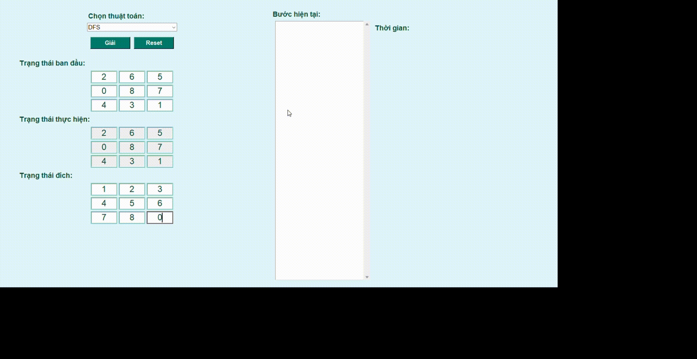
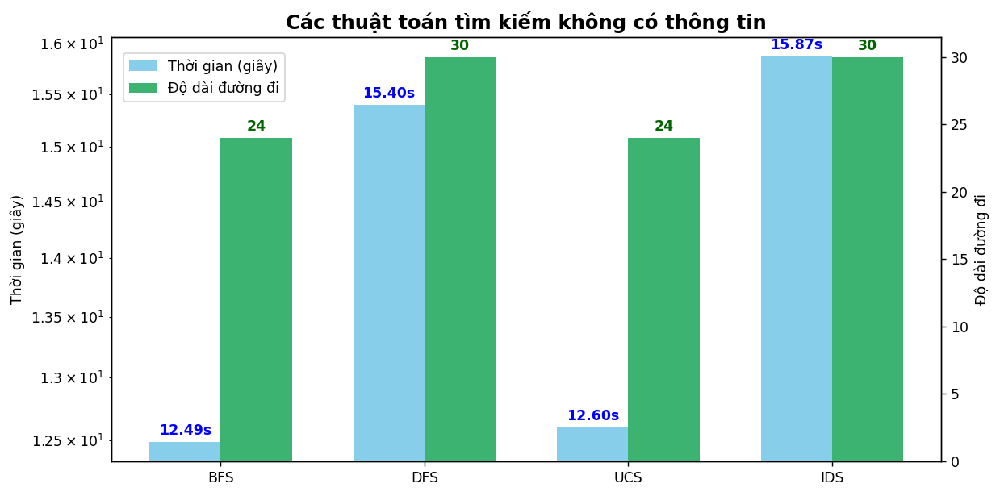
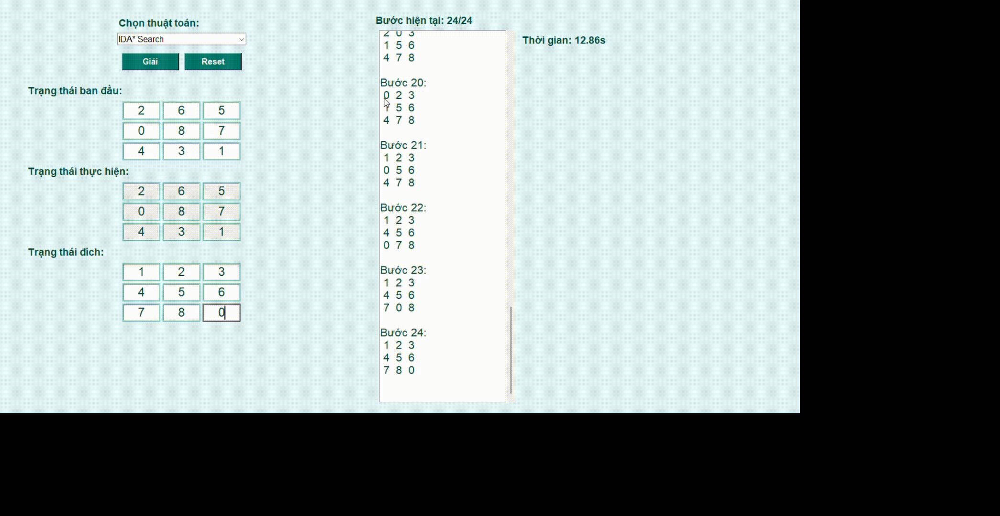
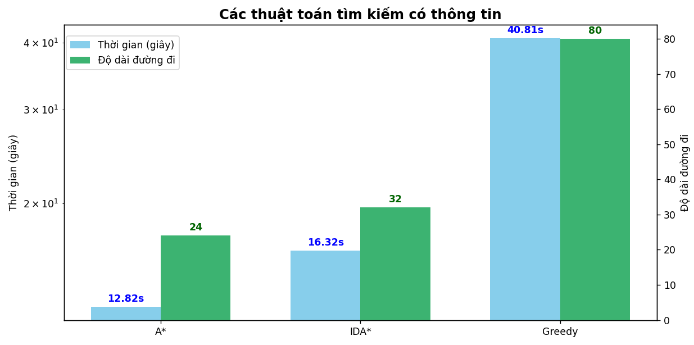
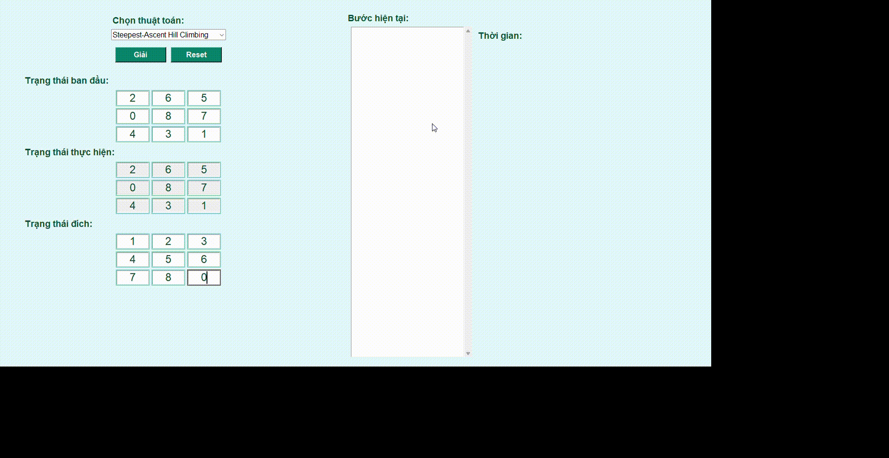
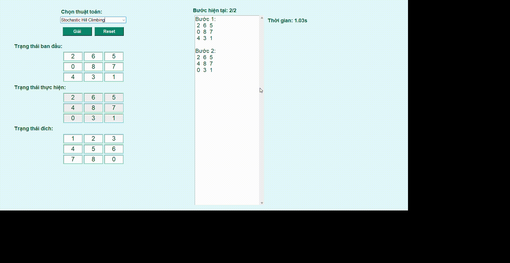
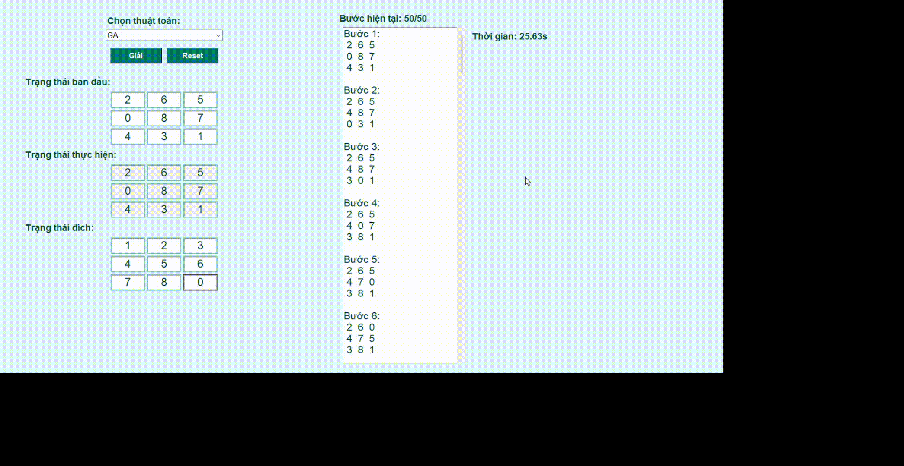
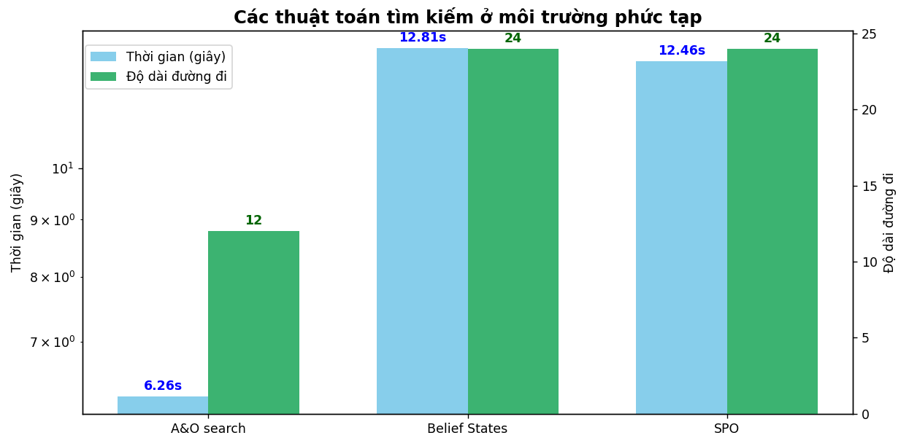
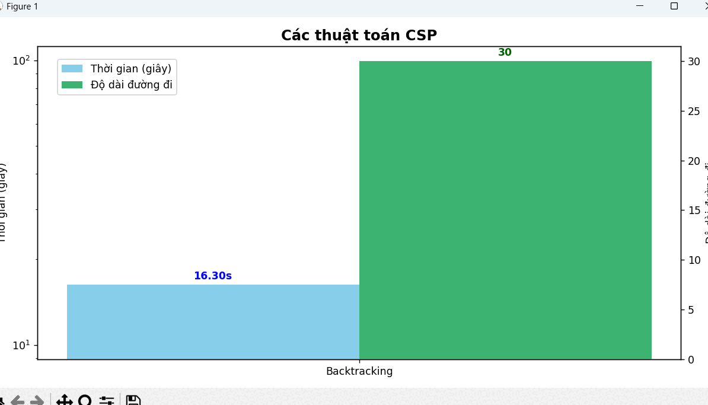
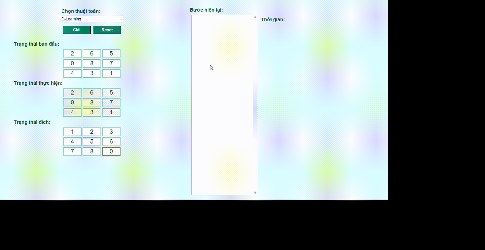

# 8 Puzzle Solver

### Sinh viên: Thái Đinh Trúc      

### MSSV: 23133081

### Báo cáo đồ án cá nhân môn Trí tuệ nhân tạo

 
# Mô tả về dự án

8-Puzzle Solver using AI Search Algorithms là một dự án mô phỏng giải tự động trò chơi 8-Puzzle – trò chơi sắp xếp lại các ô số từ trạng thái ban đầu về trạng thái đích sao cho chỉ được di chuyển các ô liền kề với ô trống và mỗi bước chỉ đổi chỗ hai ô.

Dự án cung cấp một giao diện đồ họa thân thiện sử dụng thư viện PyGame, nơi người dùng có thể lựa chọn trạng thái đầu vào và thuật toán giải, đồng thời quan sát trực tiếp quá trình tìm kiếm lời giải thông qua animation trực quan và sinh động. Đây là một môi trường thử nghiệm lý tưởng để minh họa và kiểm chứng hoạt động của các thuật toán tìm kiếm trong lĩnh vực Trí tuệ nhân tạo (AI).

# 1. Mục tiêu

Mục tiêu của project này là nghiên cứu, cài đặt và so sánh các thuật toán tìm kiếm (có và không có thông tin) và các phương pháp meta-heuristic để giải quyết bài toán 8-puzzle. Qua đó giúp hiểu rõ hơn về cách hoạt động, hiệu suất và ứng dụng thực tế của từng thuật toán trong lĩnh vực Trí tuệ nhân tạo (AI).

# 2. Nội dung

## 2.1 Các thuật toán Tìm kiếm không có thông tin

Các thuật toán tìm kiếm không có thông tin (uninformed search) là những thuật toán không sử dụng bất kỳ thông tin bổ sung nào về mục tiêu, ngoài mô hình không gian trạng thái. Chúng chỉ dựa trên cấu trúc của bài toán để khám phá lời giải.

### 2.1.1 Thuật toán BFS (Breadth-First Search)

Thuật toán BFS (Breadth-First Search) là phương pháp tìm kiếm theo chiều rộng, duyệt qua không gian trạng thái theo từng lớp. Khi áp dụng vào bài toán 8-Puzzle, BFS bắt đầu từ trạng thái ban đầu và mở rộng lần lượt các trạng thái kề bằng cách di chuyển ô trống (0) lên, xuống, trái hoặc phải. Mỗi trạng thái được lưu cùng đường đi đã thực hiện trong hàng đợi (queue), đồng thời sử dụng tập hợp các trạng thái đã thăm để tránh lặp lại. Nhờ đó, BFS đảm bảo tìm được lời giải ngắn nhất (ít bước nhất) nếu tồn tại, tuy nhiên có thể tiêu tốn nhiều bộ nhớ khi không gian trạng thái lớn.

#### Gif minh họa: 

### 2.1.2 Thuật toán DFS (Depth-First Search)

Thuật toán DFS (Depth-First Search) là phương pháp tìm kiếm theo chiều sâu, ưu tiên đi sâu vào từng nhánh con trước khi quay lại và mở rộng các nhánh khác. Khi áp dụng vào bài toán 8-Puzzle, DFS bắt đầu từ trạng thái ban đầu và di chuyển ô trống theo các hướng hợp lệ để khám phá sâu nhất có thể trong không gian trạng thái. Thuật toán sử dụng ngăn xếp (stack) để quản lý thứ tự duyệt và có thể sử dụng tập hợp các trạng thái đã thăm để tránh lặp lại. DFS thường có bộ nhớ sử dụng thấp hơn BFS, nhưng không đảm bảo tìm được lời giải ngắn nhất và có nguy cơ bị kẹt trong các nhánh vô vọng nếu không giới hạn độ sâu.

#### Gif minh họa: 

### 2.1.3 Thuật toán UCS (Uniform Cost Search)

Thuật toán UCS (Uniform Cost Search) là một biến thể của tìm kiếm theo chiều rộng, trong đó việc mở rộng các trạng thái được ưu tiên theo tổng chi phí đường đi từ trạng thái ban đầu đến trạng thái hiện tại. Khi áp dụng vào bài toán 8-Puzzle, UCS sử dụng một hàng đợi ưu tiên (priority queue) để lựa chọn trạng thái có chi phí thấp nhất tiếp theo để mở rộng, trong khi vẫn đảm bảo kiểm tra các trạng thái đã thăm để tránh lặp. UCS đảm bảo tìm được lời giải tối ưu nếu chi phí di chuyển giữa các trạng thái được xác định rõ và không âm. Tuy nhiên, tương tự BFS, UCS cũng có thể tiêu tốn nhiều bộ nhớ và thời gian nếu không gian trạng thái quá lớn. Trong 8-Puzzle, UCS thường có hiệu quả tương tự BFS khi chi phí mỗi bước đi là như nhau, nhưng trở nên hữu ích hơn nếu chi phí được gán khác nhau cho từng thao tác.

#### Gif minh họa: 

### 2.1.4 Thuật toán IDS (Iterative Deepening Search)

Thuật toán IDS (Iterative Deepening Search) kết hợp ưu điểm của DFS và BFS bằng cách thực hiện nhiều lần tìm kiếm theo chiều sâu có giới hạn (Depth-Limited Search), với giới hạn độ sâu tăng dần sau mỗi vòng lặp. Khi áp dụng vào bài toán 8-Puzzle, IDS bắt đầu từ trạng thái ban đầu và thực hiện DFS với độ sâu giới hạn là 0, sau đó tăng giới hạn lên 1, 2, 3,... cho đến khi tìm được lời giải. Thuật toán đảm bảo tìm được lời giải ngắn nhất như BFS nhưng sử dụng bộ nhớ tiết kiệm hơn, tương tự DFS. Nhược điểm của IDS là lặp lại nhiều lần việc duyệt các nút ở gần gốc, khiến thời gian thực thi có thể tăng. Tuy nhiên, trong các bài toán có không gian trạng thái lớn như 8-Puzzle, IDS là một lựa chọn cân bằng giữa tối ưu và hiệu quả bộ nhớ.

#### Gif minh họa: 

### So sánh hiệu suất của các thuật toán tìm kiếm không có thông tin

  

### Nhận xét:

- BFS đảm bảo tìm được lời giải tối ưu nếu chi phí bằng nhau nhưng tiêu tốn nhiều bộ nhớ.

- DFS có thể đi rất sâu và nhanh nhưng dễ bị kẹt ở nhánh sai.

- UCS hiệu quả hơn BFS nếu có chi phí khác nhau, nhưng phức tạp hơn về cài đặt.

- IDS kết hợp điểm mạnh của BFS và DFS nhưng tốn thời gian lặp lại.

## 2.2 Các thuật toán Tìm kiếm có thông tin

Các thuật toán tìm kiếm có thông tin (informed search) sử dụng thông tin bổ sung (heuristic) để hướng dẫn quá trình tìm kiếm, từ đó tìm ra lời giải nhanh và hiệu quả hơn.

### 2.2.1 Thuật toán A* Search (A star)

Thuật toán A* là một thuật toán tìm kiếm có thông tin nổi bật nhờ khả năng tìm lời giải tối ưu với chi phí thấp nhất. A* sử dụng hàm chi phí f(n) = g(n) + h(n), trong đó g(n) là chi phí từ trạng thái ban đầu đến trạng thái hiện tại, còn h(n) là hàm heuristic ước lượng chi phí từ trạng thái hiện tại đến trạng thái đích. Khi áp dụng vào 8-Puzzle, các hàm heuristic thường dùng như Manhattan distance hoặc số ô sai vị trí giúp A* định hướng tốt hơn trong không gian trạng thái. Nhờ sự kết hợp giữa độ chính xác và tốc độ, A* được xem là một trong những thuật toán hiệu quả nhất để giải 8-Puzzle, tuy nhiên nó có thể tiêu tốn nhiều bộ nhớ nếu không gian trạng thái quá lớn.

#### Gif minh họa: 

### 2.2.2 Thuật toán IDA* (Iterative Deepening A*)

Thuật toán IDA* là sự kết hợp giữa A* và IDS, sử dụng chiến lược tìm kiếm theo chiều sâu có giới hạn nhưng thay vì giới hạn độ sâu, nó giới hạn theo giá trị f(n) = g(n) + h(n). Mỗi vòng lặp của IDA* tăng giới hạn f một cách thích hợp và thực hiện tìm kiếm theo chiều sâu. Khi áp dụng vào 8-Puzzle, IDA* giúp tiết kiệm bộ nhớ đáng kể so với A*, trong khi vẫn giữ được tính tối ưu nếu heuristic là chấp nhận được (admissible). Tuy nhiên, thời gian giải có thể dài hơn A* do phải lặp lại nhiều nhánh tìm kiếm khi tăng ngưỡng f.

#### Gif minh họa: 

### 2.2.3 Thuật toán Greedy Search

Thuật toán Greedy Search sử dụng hàm đánh giá f(n) = h(n) – chỉ dựa vào heuristic để lựa chọn trạng thái tiếp theo gần mục tiêu nhất, bỏ qua chi phí thực tế g(n). Khi áp dụng vào 8-Puzzle, thuật toán này ưu tiên các trạng thái “có vẻ” gần đích hơn (ví dụ dùng Manhattan distance), nhờ đó thường có tốc độ nhanh. Tuy nhiên, do không xét đến đường đi đã đi qua, Greedy không đảm bảo tìm được lời giải tối ưu và dễ bị rơi vào các nhánh sai hoặc vòng lặp cục bộ. Đây là một phương pháp nhanh nhưng thiếu độ tin cậy nếu cần lời giải tốt nhất.

#### Gif minh họa: 

### So sánh hiệu suất của các thuật toán tìm kiếm có thông tin

   

### Nhận xét:

- A* thường được xem là thuật toán hiệu quả nhất nếu chọn hàm heuristic tốt.

- IDA* tiết kiệm bộ nhớ hơn A* nhưng thời gian có thể lâu hơn.

- Greedy nhanh nhưng không đảm bảo lời giải tối ưu.

Trong bài toán 8-puzzle:

  A* với heuristic Manhattan thường cho kết quả tốt nhất (về cả thời gian và độ dài đường đi).

  Greedy dễ bị lạc đường vì chỉ nhìn gần mục tiêu.

## 2.3 Các thuật toán Local Search

Các thuật toán Local Search là những phương pháp tối ưu hóa không dựa trên việc xây dựng đường đi từ trạng thái đầu đến đích, mà tìm cách cải thiện dần trạng thái hiện tại thông qua đánh giá giá trị (hoặc độ phù hợp) của trạng thái. Trong bài toán 8-Puzzle, chúng hoạt động bằng cách hoán đổi các ô và đánh giá xem trạng thái mới có "tốt hơn" không dựa trên một hàm heuristic.

### 2.3.1 Hill Climbing

Hill Climbing là một thuật toán tìm kiếm địa phương đơn giản, luôn di chuyển đến trạng thái láng giềng có giá trị heuristic tốt hơn hiện tại (ví dụ ít ô sai hơn). Quá trình kết thúc khi không còn trạng thái nào tốt hơn, dẫn đến cực đại cục bộ. Trong 8-Puzzle, Hill Climbing dễ bị mắc kẹt nếu cấu hình ban đầu không tốt.

####Gif minh họa: 

### 2.3.2 Steepest Ascent Hill Climbing

Phiên bản cải tiến của Hill Climbing, thuật toán Steepest Ascent Hill Climbing đánh giá tất cả các trạng thái láng giềng và chọn ra trạng thái tốt nhất để di chuyển. Dù có cơ hội thoát khỏi các bước leo dốc sai hướng, nó vẫn có thể bị kẹt ở cực trị cục bộ nếu không có trạng thái nào tốt hơn.

#### Gif minh họa:  
 

### 2.3.3 Stochastic Hill Climbing

Stochastic Hill Climbing chọn ngẫu nhiên một trạng thái láng giềng trong số các trạng thái tốt hơn, thay vì chọn trạng thái tốt nhất. Nhờ yếu tố ngẫu nhiên, thuật toán có khả năng tránh các cực trị cục bộ tốt hơn so với Hill Climbing thông thường, nhưng kết quả cũng thiếu ổn định.

#### Gif minh họa: 

### 2.3.4 Simulated Annealing

Simulated Annealing là một kỹ thuật tìm kiếm lấy cảm hứng từ quá trình tôi kim loại, cho phép di chuyển tới trạng thái kém hơn với xác suất giảm dần theo thời gian (nhiệt độ). Nhờ đó, thuật toán có khả năng thoát khỏi cực trị cục bộ và tìm được lời giải toàn cục. Trong 8-Puzzle, đây là một trong những phương pháp local search hiệu quả nếu được tinh chỉnh tốt.

#### Gif minh họa:

### 2.3.5 Beam Search

Beam Search giữ một tập hợp giới hạn k trạng thái tốt nhất ở mỗi bước thay vì chỉ một. Tại mỗi vòng lặp, các trạng thái con được tạo ra từ k trạng thái hiện tại, và chỉ giữ lại k trạng thái tốt nhất cho vòng tiếp theo. Beam Search cân bằng giữa hiệu quả và độ chính xác, nhưng không đảm bảo tối ưu.

#### Gif minh họa: 

### 2.3.6 Genetic Algorithm

Genetic Algorithm (GA) là một phương pháp mô phỏng quá trình tiến hóa tự nhiên. Mỗi trạng thái là một “cá thể”, sử dụng các thao tác chọn lọc, lai ghép (crossover) và đột biến (mutation) để tạo thế hệ mới. GA không đảm bảo tìm lời giải tối ưu, nhưng có thể tìm được lời giải tốt trong thời gian ngắn nếu thiết kế hàm đánh giá và các phép lai/đột biến phù hợp. Trong 8-Puzzle, biểu diễn và đánh giá trạng thái là yếu tố then chốt để GA hoạt động hiệu quả.

#### Gif minh họa: 

### So sánh hiệu suất của các thuật toán Local Search

#### 

### Nhận xét:

- Hill Climbing: Dễ cài đặt nhưng dễ bị kẹt ở cực trị cục bộ.
  

- Steepest Ascent Hill Climbing: Tốt hơn hill climbing cơ bản nhưng vẫn dễ mắc kẹt.
  

- Stochastic Hill Climbing: Giảm khả năng kẹt nhờ yếu tố ngẫu nhiên, nhưng kết quả không ổn định.

- Simulated Annealing: Có thể thoát cực trị cục bộ bằng cách chấp nhận trạng thái xấu tạm thời.
  

- Beam Search: Duyệt song song nhiều hướng nhưng không đảm bảo tìm lời giải tối ưu.

- Genetic Algorithm: Khám phá tốt không gian lớn nhưng phụ thuộc vào thiết kế hàm đánh giá và biến đổi.

## 2.4 Các thuật toán tìm kiếm ở môi trường phức tạp

Trong môi trường phức tạp – nơi thông tin không đầy đủ, không xác định hoặc có nhiều khả năng kết quả – các thuật toán tìm kiếm truyền thống không còn hiệu quả. Các thuật toán dưới đây được thiết kế để giải quyết bài toán trong điều kiện không chắc chắn hoặc có nhiều nhánh kết quả.

### 2.4.1 Thuật toán And-Or Search

Thuật toán And-Or Search được dùng trong các môi trường không xác định, nơi một hành động có thể dẫn đến nhiều kết quả khác nhau (non-deterministic). Cây tìm kiếm có hai loại nút: OR-nodes: đại diện cho các lựa chọn của tác nhân. AND-nodes: đại diện cho việc phải xử lý tất cả các kết quả có thể của một hành động.

#### Gif minh họa: 

### 2.4.2 Thuật toán Belief State Search

Belief State Search được dùng trong môi trường ẩn thông tin hoàn toàn hoặc một phần, nơi trạng thái hiện tại của hệ thống không xác định rõ ràng. Một belief state là tập hợp các trạng thái có thể xảy ra, và thuật toán tìm kiếm trong không gian của các belief states thay vì trạng thái đơn lẻ.

#### Gif minh họa: 

### 2.4.3 Thuật toán SPO (Search with Partially Observable)

SPO là chiến lược tìm kiếm trong môi trường quan sát một phần, nơi tác nhân không thể quan sát hoàn toàn trạng thái hiện tại. Thuật toán kết hợp hành động và quan sát để cập nhật trạng thái niềm tin (belief) và ra quyết định phù hợp theo từng bước.

#### Gif minh họa: 

### So sánh hiệu suất của các thuật toán tìm kiếm ở môi trường phức tạp

 

### Nhận xét:

- And-Or Search: Giải quyết tốt các bài toán không xác định với nhiều kết quả khả dĩ, nhưng cấu trúc cây phức tạp và khó mở rộng.

- Belief State Search: Hiệu quả trong môi trường không chắc chắn, nhưng không gian trạng thái niềm tin (belief) có thể rất lớn và khó kiểm soát.

- SPO (Search with Partially Observable): Thích hợp cho môi trường quan sát không đầy đủ, nhưng đòi hỏi cơ chế cập nhật và lập kế hoạch phức tạp theo từng quan sát.

## 2.5 Các thuật toán CSP
Các thuật toán CSP được dùng để giải các bài toán trong đó lời giải là tập hợp các giá trị thỏa mãn ràng buộc giữa các biến, không cần xác định đường đi mà tập trung vào sự hợp lệ của cấu hình cuối.

### 2.5.1 Thuật toán Backtracking

Thuật toán Backtracking duyệt toàn bộ không gian nghiệm bằng cách gán giá trị cho từng biến một cách tuần tự và quay lui khi phát hiện xung đột với các ràng buộc đã có.

#### Gif minh họa: 

### 2.5.2 Thuật toán Backtracking with Forward Checking

Phiên bản mở rộng của backtracking, Forward Checking loại bỏ trước các giá trị không hợp lệ trong miền giá trị của các biến chưa gán sau mỗi lần gán biến hiện tại.

#### Gif minh họa: 

### So sánh hiệu suất của các thuật toán CSP

 

### Nhận xét: 

- Backtracking:Dễ cài đặt và đúng đắn nhưng tốc độ chậm nếu không có chiến lược hỗ trợ.

  
- Backtracking with Forward Checking: Nhanh hơn backtracking cơ bản nhờ giảm số nhánh sai sớm, nhưng tiêu tốn thêm bộ nhớ để theo dõi miền giá trị.

## 2.6 Các thuật toán Reinforcement Learning

Các thuật toán Reinforcement Learning được dùng để học cách tối ưu hóa hành động của agent trong môi trường dựa trên phần thưởng nhận được, nhằm tìm chính sách hành động tốt nhất theo thời gian.

### 2.6.1 Thuật toán Q-learning

Q-learning là thuật toán học tăng cường off-policy dựa trên cập nhật giá trị hành động Q bằng phần thưởng thực tế và giá trị hành động tối ưu ở trạng thái kế tiếp.

#### Gif minh họa:

### 2.6.2 Thuật toán SARSA

SARSA là thuật toán học tăng cường on-policy, cập nhật giá trị Q dựa trên hành động thực tế agent chọn theo chính sách hiện tại.

#### Gif minh họa:  

### So sánh hiệu suất của các thuật toán Reinforcement Learning

Mặc dù em định áp dụng Q-learning và SARSA để giải bài toán 8-Puzzle, nhưng quá trình huấn luyện gặp nhiều trở ngại do:

- Không gian trạng thái của bài toán quá lớn để lưu trữ bằng Q-table thông thường.

- Mô hình học tăng cường không hiệu quả với bài toán có phần thưởng khan hiếm như 8-Puzzle.

- Việc cài đặt và huấn luyện cần số lượng bước rất lớn để thấy được sự khác biệt giữa hai thuật toán.

Do đó, em không thể chạy được kết quả để so sánh hiệu suất Q-learning và SARSA trên bài toán này.
 

### Nhận xét: 

- Q-learning: Học chính sách tối ưu độc lập với hành động agent đang thực hiện, dễ áp dụng nhưng có thể ít an toàn trong môi trường không ổn định.

  
- SARSA: Học theo chính sách hiện tại, an toàn hơn trong môi trường thay đổi, nhưng có thể chậm hội tụ hơn Q-learning.

# So sánh tổng hợp 

Để đánh giá hiệu suất của các thuật toán giải bài toán 8-puzzle, ta sử dụng cùng một trạng thái khởi đầu (ví dụ: [[1, 2, 3], [4, 0, 6], [7, 5, 8]]) và chạy từng thuật toán nhiều lần để lấy kết quả trung bình nếu có yếu tố ngẫu nhiên. Các tiêu chí đánh giá bao gồm thời gian thực thi, số bước đi trong lời giải, số node mở rộng, bộ nhớ sử dụng và tỷ lệ thành công. Kết quả cho thấy, các thuật toán như BFS và UCS đảm bảo tìm lời giải tối ưu về độ dài đường đi và chi phí, tuy nhiên chúng tiêu tốn nhiều bộ nhớ và thời gian xử lý khi không gian trạng thái lớn. DFS nhanh và sử dụng ít bộ nhớ hơn nhưng không đảm bảo tối ưu và dễ bị kẹt trong các nhánh sai, dẫn đến tỷ lệ thành công thấp hơn. IDS kết hợp ưu điểm của BFS và DFS, tiết kiệm bộ nhớ hơn BFS nhưng lại mất thêm thời gian do việc lặp lại duyệt các nút gần gốc. Trong nhóm các thuật toán có thông tin, A* với heuristic Manhattan cho kết quả tốt nhất về cả thời gian và độ dài đường đi, trong khi IDA* tiết kiệm bộ nhớ hơn nhưng thời gian thực thi lâu hơn. Thuật toán Greedy nhanh hơn nhưng không đảm bảo tìm lời giải tối ưu và dễ bị lạc hướng. Các thuật toán local search như Hill Climbing, Simulated Annealing hay Genetic Algorithm phù hợp với không gian tìm kiếm lớn, cho phép tìm lời giải tốt trong thời gian hợp lý nhưng không đảm bảo hội tụ và cần chạy nhiều lần để nâng cao tỷ lệ thành công. Tổng thể, lựa chọn thuật toán phù hợp phụ thuộc vào yêu cầu cân bằng giữa thời gian, bộ nhớ, độ tối ưu lời giải và khả năng hội tụ trong không gian trạng thái cụ thể.

# 3. Kết luận 

## 3.1 Kết quả quả thu được 

Qua quá trình nghiên cứu và thực nghiệm trên bài toán 8-puzzle, project đã triển khai và so sánh hiệu suất của 6 nhóm thuật toán gồm: tìm kiếm không có thông tin, tìm kiếm có thông tin, local search, tìm kiếm trong môi trường phức tạp, giải ràng buộc (CSP) và học tăng cường (Reinforcement Learning). Mỗi thuật toán được cài đặt và đánh giá dựa trên các tiêu chí như: thời gian thực thi, số bước đi, số node mở rộng, bộ nhớ sử dụng và tỷ lệ thành công. Kết quả cho thấy mỗi nhóm có những ưu điểm riêng: A* và IDA* có hiệu suất cao nhờ tận dụng heuristic; BFS và UCS đảm bảo tìm được lời giải tối ưu nhưng tốn tài nguyên; IDS cân bằng giữa bộ nhớ và độ chính xác; local search thích hợp cho không gian lớn nhưng cần chạy nhiều lần; trong khi Q-learning và SARSA cho phép học dần từ trải nghiệm, phù hợp với các môi trường động và chưa biết rõ luật.

## 3.2 Hướng phát triển

Trong tương lai, project có thể mở rộng theo các hướng như: tích hợp giao diện tương tác để trực quan hóa đường đi và so sánh thuật toán; áp dụng các bài toán lớn hơn như 15-puzzle hoặc Rubik’s Cube; thử nghiệm các thuật toán nâng cao hơn như Deep Q-Network (DQN), Monte Carlo Tree Search hoặc các biến thể heuristic tối ưu hơn; đồng thời đo lường chính xác bộ nhớ sử dụng và tối ưu hóa hiệu năng xử lý. Việc kết hợp nhiều thuật toán hoặc hybrid approach (ví dụ: A* kết hợp học tăng cường) cũng là một hướng tiềm năng để cải thiện khả năng tìm kiếm trong các không gian trạng thái phức tạp hơn.
